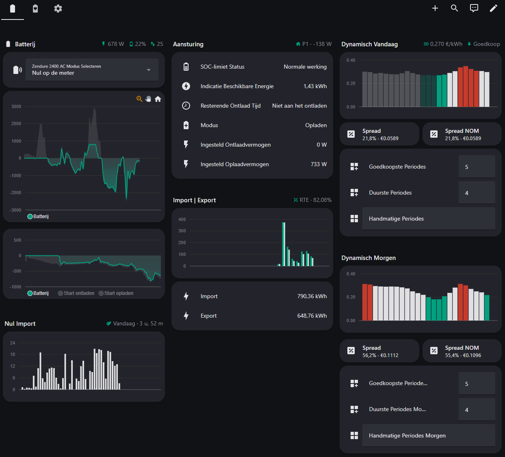

#  Zendure Home Assistant Integratie
[](https://github.com/Gielz1986/Zendure-HA-zenSDK/releases)
[](https://github.com/Gielz1986/Zendure-HA-zenSDK/issues)
[](https://github.com/Gielz1986/Zendure-HA-zenSDK/issues)

 <br>
<sub>
<a href="https://github.com/Gielz1986/Zendure-HA-zenSDK/wiki/3-%E2%80%90-Beschikbare-entiteiten">
Ga naar de uitleg over alle entiteiten en het dashboard
</a>
</sub>

<br>

**Om in slechts 2️⃣ simpele stappen je batterij volledig lokaal werkend te krijgen in Home Assistant.**

Gebaseerd op de zenSDK RESTful API voor Home Assistant. Deze package maakt lokaal verbinding met één Zendure Solarflow 2400 (AC, AC+ of AC Pro) / Zendure Solarflow 1600 AC+ / Zendure Solarflow 800 (Pro of Plus). Perfect voor iedereen die zijn batterij **100% lokaal en volledig onder eigen controle** wil draaien in Home Assistant. Inmiddels zijn er **11 voorgeprogrammeerde modussen**  — van heerlijk NOMen op basis van de grote vuurbal tot energieboer spelen met dynamisch handelen voor een paar stuivers.

Heb je de smaak te pakken en meerdere omvormers staan? Dan kun je dit uitbreiden met de [Node-RED proxy van Gast777](https://github.com/gast777/Zendure-zenSDK-proxy). Met deze proxy zorgt Node-RED ervoor dat alles binnen deze automatisering naadloos samenwerkt, waardoor meerdere identieke omvormers slim worden aangestuurd met een optimale vermogensverdeling.

Vind je dit project nuttig en wil je verdere ontwikkeling supporten? <br>
Trakteer mij op een kopje koffie ☕️ en volg deze GitHub repository ⭐⭐⭐.

<a href="https://www.buymeacoffee.com/gielz" target="_blank">
  
</a><br><br>


## 1️⃣ Entiteiten beschikbaar maken

#### ℹ️ Benodigde hardware

- Homewizard P1 (of een andere P1/CT-meter die data per seconden levert (+watt afname / -watt teruglevering).
- één Solarflow 2400 (AC, AC+ of AC Pro) / Solarflow 1600 AC+ / Solarflow 800 (Pro of Plus).
- Of twee dezelfde omvormers in combinatie met de [Node-RED proxy van Gast777](https://github.com/gast777/Zendure-zenSDK-proxy)

---

### #️⃣ Configuratie en herstart

<details>
  <summary>🖱️ <strong>Klik hier</strong> 🖱️ voor de configuratie via een package waarbij de configuration.yaml schoon blijft.</summary>


---

1. Zorg ervoor dat **HEMS is uitgeschakeld** in de Zendure-app.
2. Plaats `zendure_ha_zensdk_gielz1986.yaml` uit de map packages van GitHub in de map packages van Home Assistant. Mocht de map packages niet bestaan maak deze dan aan.
3. Maak nu een **backup** van je `configuration.yaml`.
4. Pas daarna je `configuration.yaml` aan door de onderstaande regel toe te voegen.

```
homeassistant:
  packages: !include_dir_named packages
```

|  |
|-----------------------------------|

5. Herstart Home Assistant.
6. Optioneel kun je nu het plug-n-play dashboard aanmaken [Ga naar Plug-N-Play Dashboard](#-optioneel-plug-n-play-dashboard). Of vul nu bij de onderstaande entiteiten in Home Assistant de juiste gegevens in en herstart Home Assistant nogmaals.

---


</details>

<details>
  <summary>🖱️ <strong>Klik hier</strong> 🖱️ voor de klassieke configuratie waarbij alles in de configuration.yaml zit.</summary>
  
---

1. Zorg ervoor dat **HEMS is uitgeschakeld** in de Zendure-app.
2. Maak eerst een **backup** van je `configuration.yaml`.
3. Pas daarna je `configuration.yaml` aan door gebruik te maken van de GitHub `configuration.yaml`.
4. Herstart Home Assistant.
5. Optioneel kun je nu het plug-n-play dashboard aanmaken [Ga naar Plug-N-Play Dashboard](#-optioneel-plug-n-play-dashboard). Of vul nu bij de onderstaande entiteiten in Home Assistant de juiste gegevens in en herstart Home Assistant nogmaals.

---

</details>

 
<sub>*plug-n-play dashboard</sub>

<br>

| Uitleg per configuratie item | |  
|-|-|
| **Configuratie (Basis)** | **Informatie**|  
| `zendure_2400_ac_ip_adres`       | **bijvoorbeeld 192.168.0.172** – In de Zendure app onder device Information |  
| `homewizard_p1_ip_adres`    | **(Instellingsadvies: gebruik een Homewizard P1) bijvoorbeeld 192.168.0.192** – In de Homewizard app (lokale API aanzetten)  |  
| `zendure_2400_ac_standby_vertraging` | **(Instellingsadvies: 15 minuten) 5-30 minuten** – Geef hier aan hoe snel de omvormer 100% in standby gaat bij 0 activiteit. Dit voorkomt sluipverbruik van +/- 19 watt | 
| `zendure_2400_ac_advies_instellingen_overnemen` | Zodra de batterij draait kun je met deze knop de onderstaande instellingsadviezen direct overnemen. | 
| **Configuratie (Opladen)** |**Informatie**|  
| `zendure_2400_ac_max_oplaadvermogen`    | **800 t/m 2400 watt** – Geef hier aan met hoeveel vermogen hij maximaal mag laden. Bij meerdere omvormers via Node-RED kan dit tot 4800 watt  |  
| `zendure_2400_ac_opladen_starten_bij` | **(Instellingsadvies: -300 watt) -1000 t/m -100 watt** – hier geef je aan wanneer de batterij exact begint met opladen. Daarna balanceert de batterij naar 0 - de extra oplaadmarge  | 
| `zendure_2400_ac_oplaadmarge` | **(Instellingsadvies: 50 watt) 0 t/m 250 watt** – Geef hier aan hoeveel minder je wilt meenemen tijdens opladen. Als je wat minder wilt opladen, in de zomer met voldoende opwek zou je dit zelfs op 200 kunnen zetten om import overdag 100% te voorkomen. (Zendure zelf hanteert hier 50 watt in HEMS)  | 
| **Configuratie (Ontladen)** |**Informatie**|  
| `zendure_2400_ac_max_ontlaadvermogen`    | **800 t/m 2400 watt** – Geef hier aan met hoeveel vermogen hij maximaal mag ontladen. Bij meerdere omvormers via Node-RED kan dit tot 4800 watt |  
| `zendure_2400_ac_ontladen_starten_bij` | **(Instellingsadvies: 100 watt) 100 t/m 500 watt** – hier geef je aan wanneer de batterij exact begint met ontladen. Daarna balanceert de batterij naar 0 - de extra ontlaadmarge | 
| `zendure_2400_ac_ontlaadmarge` | **(Instellingsadvies: 5 watt) 0 t/m 250 watt** – Geef hier aan hoeveel je extra wilt meenemen tijdens ontladen. Als je wat meer wilt ontladen dan noodzakelijk is | 
| **Configuratie (Optioneel)** |**Informatie**|  
| `afwijkende_p1_sensor` | **bijvoorbeeld `sensor.eigen_P1`** – je eigen afwijkende P1 sensor toevoegen waarbij +watt afname is en -watt teruglevering (vul je hier je eigen sensor in dan is deze altijd leidend). [Ga naar WIKI](https://github.com/Gielz1986/Zendure-HA-zenSDK/wiki/2-%E2%80%90-Afwijkende-P1-CT-meters-(API's)) voor afwijkende P1/CT API's. |  
| `zendure_2400_ac_batterij_volgorde` | **bijvoorbeeld 1;5;3;4;2** – hiermee bepaal je zelf een afwijkende volgorde van de batterijen. De juiste volgorde bepaal je mede aan de hand van `sensor.zendure_2400_ac_batterij_serienummers` en de sticker op de batterij(en). Op deze manier zullen de batterijtemperaturen en het laadpercentage de juiste volgorde hebben zoals die van de batterij(en) in de stapel.| 
| **Configuratie (Dynamisch)** |**Informatie**|  
| `dynamisch_nordpool_sensor` | **bijvoorbeeld `sensor.nordpool_kwh_nl_eur_3_09_0`** – je eigen sensor van Nordpool (HACS) toevoegen. Wanneer je het Dynamisch Nordpool gedeelte in gebruik gaat nemen moet je voor dat je deze in gebruik neemt bij `dynamisch_handmatige_periode` en `dynamisch_handmatige_periode_morgen` even **unknown** weghalen. Hierna zal het dynamisch gedeelte werken. Alles wat in de forecast (morgen) gezet word zal overgenomen worden om 00:00 via de automatisering en verschijnen in vandaag. |  
| `dynamisch_minimale_spread` | **bijvoorbeeld 25%** - Hiermee geef je aan vanaf hoeveel spread de batterij dynamisch gaat laden en opladen op hoog vermogen.  |  
| `dynamisch_15_minuten` | Vink dit aan wanneer je gebruik wilt maken van 15 minuten periodes  |  
| **Configuratie (Dashboard)** |**Informatie**|  
| `help_tonen_op_dashboard` | Vink dit aan om de helpteksten te tonen bij de meest relevante onderdelen.  |  
| `dynamisch_tonen_op_dashboard` | Vink dit aan om de dynamische sturing te tonen op het dashboard.  |  

<br>

## 2️⃣ Zendure zenSDK (Gielz) automatisering
De motor van alles: hij laadt slim op, ontlaadt slim, en zorgt dat alles samenwerkt. Kies uit 11 verschillende modi om hem precies zo te laten werken als jij wilt. Heb je bij het bovenstaande geen namen aangepast dan is het een kwestie van deze nieuwe automatisering aanmaken.

1. Maak een nieuwe automatisering aan.
2. Klik rechtsboven op **Bewerken in YAML**.
3. Plak de YAML-code `(zie automatisering bestand)`.
4. Sla op, en start de automatisering.

   

 

<br>

## ✅ Batterij mag aan de slag
Het moment is aangebroken: de batterij mag nu bewijzen dat hij meer is dan alleen een dure decoratie met kabels.

1. Open het plug-n-play dashboard of voeg de entiteit **Zendure 2400 AC Modus Selecteren** toe aan je eigen dashboard.
3. De modus zal op **Standby** staan.
4. Kies hier je gewenste modus om de **Zendure zenSDK (Gielz) automatisering** te activeren.
5. De batterij zal nu aan de slag gaan.

 <br>
<sub>
<a href="https://github.com/Gielz1986/Zendure-HA-zenSDK/wiki/4-%E2%80%90-De-verschillende-modussen">
Ga naar de uitleg over alle verschillende modussen
</a>
</sub>

<br>

## 🔃 (Optioneel) Plug-N-Play Dashboard
Vanaf nu is het ook mogelijk om direct een volledig plug-n-play dashboard in gebruik te nemen.

1. Voor dit dashboard is [Apexcharts HACS](https://github.com/RomRider/apexcharts-card) vereist. En (optioneel) [Graphite HACS](https://github.com/TilmanGriesel/graphite).
2. Maak een nieuw leeg dashboard aan via links onderin op ⚙️ te klikken en ga dan naar **Dashboards**.
3. Klik vervolgens op **Dashboard toevoegen** en kies voor **leeg nieuw dashboard**.
4. Open het nieuwe dashboard.
5. Klik rechtsboven op het potlood en kies daarna onder de 3 puntjes **Ruwe configuratie-editor**.
6. Plak de YAML-code `(zie dashboard bestand)`.
7. Sla op en het dashboard is volledig bruikbaar.
8. [Ga naar de WIKI](https://github.com/Gielz1986/Zendure-HA-zenSDK/wiki/3-%E2%80%90-Beschikbare-entiteiten) om uitleg te krijgen over alle entiteiten.

 
